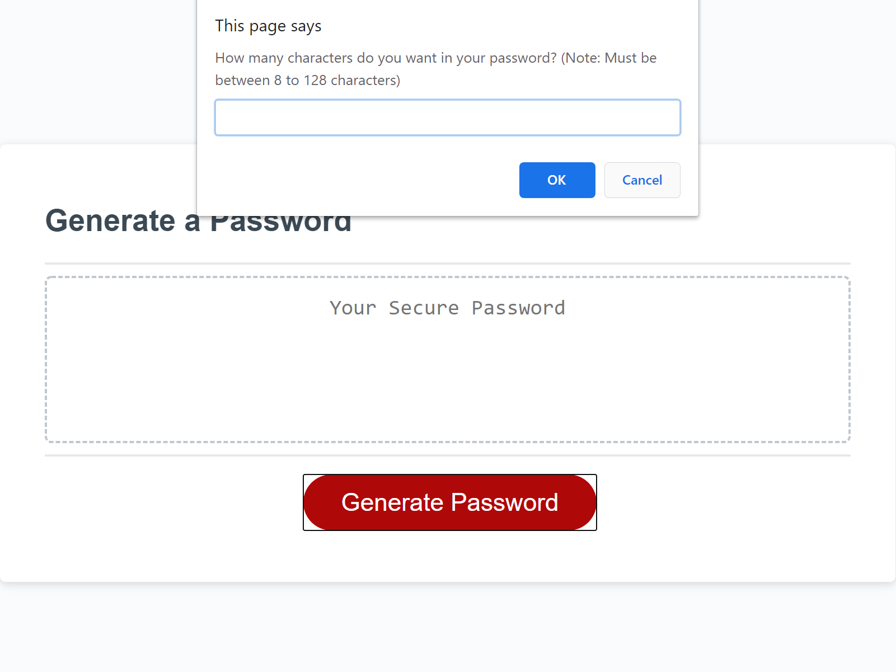

# Password Generator

## Description

Need a new password? You got it! On this page, you can get a new password generated for you with just a click of a button! In this password generator, you will find a simple "Generate Password" button that, when clicked on, will bring up a prompt to pick the length of your password, with number restrictions. If you pick too little amount, or too many numbers, it will return you to the prompt to re-pick your password length. Once you do so, it will ask you if you'd like to include, lowercase and uppercase letters, numbers, and special characters. You can decide not to include some and include others, but you MUST include AT LEAST ONE. In the end, the password will be generated using the randomizing generator and VOILA! There you have it! Your new password!!

When coding this password generator, I got a better understanding of how to use For Loops as well as If/Else statements. Not only that, but I understand functions completely now, which was something I had difficulty understanding until now.

## Credits

A special thank you goes out to the tutor that helped me understand and format this password generator.

Another thank you goes out to my fellow Coding Bootcamp students, who sat on voice call together as we put our heads together and worked hard to figure out what goes where and why.

## Layout

Official Site: https://jamjon94.github.io/password-generator/

Here's what to expect!

## License

Copyright (c) [2020] [JamieJones]

Permission is hereby granted, free of charge, to any person obtaining a copy of this software and associated documentation files (the "Software"), to deal in the Software without restriction, including without limitation the rights to use, copy, modify, merge, publish distribute, sublicense, and/or sell copies of the Software, and to permit persons to whom the Software is furnished to do so, subject to the following conditions:

The above copyright notice and this permission notice shall be included in all copies or substantial portions of the Software.

THE SOFTWARE IS PROVIDED "AS IS", WITHOUT WARRANTY OF ANY KIND, EXPRESS OR IMPLIED, INCLUDING BUT NOT LIMITED TO THE WARRANTIES OF MERCHANTABILITY, FITNESS FOR A PARTICULAR PURPOSE AND NONINFRINGEMENT. IN NO EVENT SHALL THE AUTHORS OR COPYRIGHT HOLDERS BE LIABLE FOR ANY CLAIM, DAMAGES OR OTHER LIABILITY, WHETHER IN AN ACTION OF CONTRACT, TORT OR OTHERWISE, ARISING FROM, OUT OF OR IN CONNECTION WITH THE SOFTWARE OR THE USE OR OTHER DEALINGS IN THE SOFTWARE.
